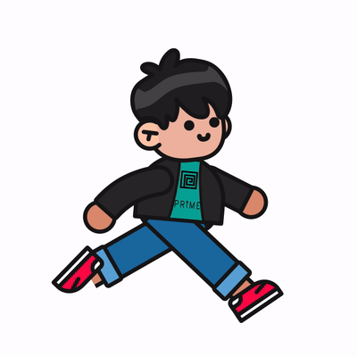
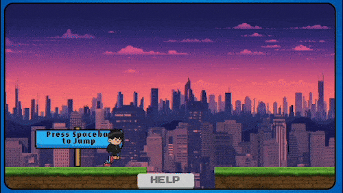

# Video Game Resume!
    
I turned my resume into a playable video game!   
**Play the game -->**  [**HERE!**](https://aquamarine-bubblegum-1105d2.netlify.app/)   

   

It is a classic platformer. It works with a **Xbox/PS5 controller** using the **Gamepad API**.    
It has custom character art and animations for the backgrounds, buildings and player.   

The application just uses vanilla **Javascript**, **HTML** and **CSS**.   
A couple small exceptions are **Google Fonts**, a custom page loader animation that uses the **Lottie** library to animate the Prime Digital Academy logo. And the **Gamepad API** to connect and play with a **video game controller!**

**Additional Tech:**  
**Lottie/LottieFiles:** Custom page loader animation. [Lottie](https://airbnb.design/lottie/#get-started)   
<!-- [GSAP](https://greensock.com/gsap/), -->
**Fonts:** [Google Fonts](https://fonts.google.com/)   
**Xbox Controller API/Code:** created by CodingWith-Adam:
    [GitHub](https://github.com/CodingWith-Adam/gamepad-api-simple-game),
    [Main Tutorial](https://www.youtube.com/watch?v=GOjMP6WY8CU&ab_channel=CodingWithAdam),
    [GamePad Tester](https://github.com/NateNotermann/GamePad-API),
    [GamePad Game](https://github.com/NateNotermann/GamePad-API-Test-Game)

**Deekay Tool:** Custom character animations in After Effects. [Deekay Tool](https://motiondesign.school/products/deekay-tool/)   
**MidJourney:** AI Image generation for all custom building & background art, with lots of tweaking in **Photoshop**. [MidJourney](https://www.midjourney.com/)

## Controls: 
**Move right:** D Key    
**Move left:** A Key    
**Jump:** W Key   
**Attack:** Space Bar  

This is a continuation of another project I made. You can test the original project out [HERE](https://javascriptfightinggame.netlify.app/)!    
You can also **start your own repo** off of the [Javascript Fighting Game Template](https://github.com/NateNotermann/Javascript-Fighting-Game-2.0) I made by following a great [Tutorial](https://www.youtube.com/watch?v=vyqbNFMDRGQ&ab_channel=ChrisCourses) by [Chris Course](https://github.com/chriscourses).    
I highly recommend checking out his tutorial and other work on his [YouTube Page](https://www.youtube.com/@ChrisCourses).   

## Preview

<!-- ### A.Early Preview, B.Original Template WITHOUT Custom Art
A.-> -> B. 

<!-- ### A. Character & Movement Tests 1, B. Custom Character Test 2
A.-> -> B.  -->

<!-- ### Background (work in progress)
 -->

<!-- ### Foreground Buildings (work in progress)
    --> 

<!-- **Player 2**  
Move right: Right Arrow  
 Move left: Left Arrow  
Jump: Up Arrow  
Attack: (left)Option button   -->

<!-- ## To Do List:
### Phase 1. Full Javascript Fighting Game -- DONE
#### Basic Fighting Mechanics:   
Project Setup - DONE   
Create Player and Enemy - DONE   
Move Characters with event listeners - DONE    
Attacks - DONE    
Health Bar Interface - DONE    
Game Timers and Game Over - DONE  

#### Sprites and Animation:
Background Sprite - DONE    
shop Sprite with animation - DONE     
Player sprite (Samurai Mack)
    Idle - DONE    
    Run - DONE          
    Jump - DONE          
    Attack    
Enemy Sprite (Kenji)
    Idle - DONE    
    Run - DONE           
    Jump - DONE           
    Attack - DONE    
React to Sprite Animation - DONE    
Death Hit Animation - DONE       
Interface Design and animation - DONE    
Limit requestAnimationFrame to 60 fps - DONE
Pushing Live - DONE

### Phase 2. Platformer Functionality & Custom Pixel Art
#### Adding Platformer Game Functionality
Add a frame around the video game canvas to look like a Game Boy. Or BMO from Adventure Time. -- DONE    
Make Game Boy frame responsive/resize when window changes size. -- DONE   
Remove Health bar 2 player win/loose scenarios -- Done   
Moved Player 2 movement into player one. -- Done       

#### Platforms
Add Platform collision functionality -- Done  
Add scroll animation to the background - Done  
Add Parallax Scroll to all elements - Done  
Scrolling Win scenario - Rework code  
Add Death Pits - Done  

#### Custom Pixel Art
Custom Player Sprites - Done  
    A. Sprite Standing Right - Done   
    B. Sprite Standing Left - Done   
    C. Sprite Running Right - Done   
    D. Sprite Running Left - Done   
     
Custom Building Background Art      
    A. Custom Sky Background, Redo with 1080p Height - Done  
    B. Custom Background Buildings - Done   
    C. Custom Middle Buildings - Done  
    D. Custom Fore Buildings - Done 
    E. Custom main Buildings Animations - Done   
        1. MCTC - Done    
        2. Restaurants - Done   
        3. Coyote - Done   
        4. Graphic Design - Done  
        5. CBRE - Done    
        6. Prime - Done   
        7. HGA - Done  
    F. Add collision descriptions Main buildings. - Done  
    G. Add collision glow effect to Main buildings. - Done  
    H. Arrow pointing where to go. - Done   
    I. Add Arrow lights. - Done   

Custom Platform Art- Done       
Moving Clouds Custom Art - Done    
make scroll with player - Done    

#### Final Stage & Clean Up
Add page loader - Done    
Job Description Modals - Done    
Add Help Button - Done    
Moving platforms  - Done   
Moving platform collision - Done   

## Game Boy Frame & Buttons  
Add controller & keyboard buttons to the Game Boy frame.  - Done    
Make controller & keyboard buttons react when pressed. - Done      

#### Final Steps      
Place More/All Platforms - Done      
Deploy to Netlify - Done  
Celebratory Dance - Done     

### Stretch Goals:    
Add Sound Effects    
Add Music     -->
