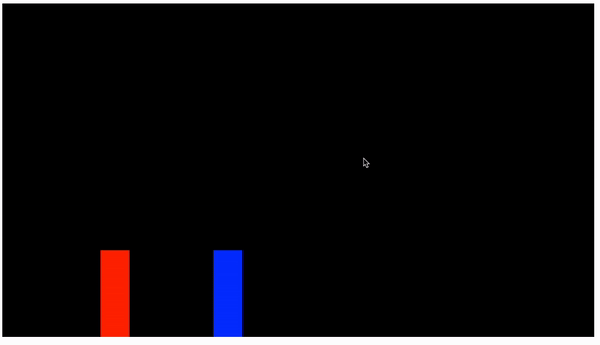

# Video Game Resume!

I am turning my resume into a playable video game! This is very much a **work in progress**. 
It will be a platformer, possibly with some fighting mechanics. It works with a **Xbox/PS5 controller** using the **gamepad API**. It will have custom pixel art for the player & player animations, background and animated Gif foreground building elements. (you'll see what I mean when it's done.)    
 
This a continuation of another project I made. You can test the original project out [HERE](https://javascriptfightinggame.netlify.app/)!    
You can also **start your own repo** off of the [Javascript Fighting Game Template](https://github.com/NateNotermann/Javascript-Fighting-Game-2.0) I made by following a great [Tutorial](https://www.youtube.com/watch?v=vyqbNFMDRGQ&ab_channel=ChrisCourses) by [Chris Course](https://github.com/chriscourses).    
I highly recommend checking out his tutorial and other work on his [YouTube Page](https://www.youtube.com/@ChrisCourses).   

The original app uses just basic **HTML**, **CSS** and **Javascript**. I then added some libraries and the **Gamepad API**. See below.  
**Libraries:**
    [GSAP](https://greensock.com/gsap/),
    [Google Fonts](https://fonts.google.com/)   
**Xbox Controller API/Code created by CodingWith-Adam:**
    [GitHub](https://github.com/CodingWith-Adam/gamepad-api-simple-game),
    [Main Tutorial](https://www.youtube.com/watch?v=GOjMP6WY8CU&ab_channel=CodingWithAdam),
    [GamePad Tester](https://github.com/NateNotermann/GamePad-API),
    [GamePad Game](https://github.com/NateNotermann/GamePad-API-Test-Game)

## Development Evolution
### A.Early Preview, B.Original Template WITHOUT Custom Art
A.-> -> B. 

### A. Character & Movement Tests 1, B. Custom Character Test 2
A.-> -> B. 

### Background (work in progress)

### Foreground Buildings (work in progress)
   

### Controls: 
**Player 1**  
Move right: D key  
Move left: A key  
Jump: W  
Attack: Space Bar  

**Player 2**  
Move right: Right Arrow  
 Move left: Left Arrow  
Jump: Up Arrow  
Attack: (left)Option button  

## To Do List:
### Phase 1. Full Javascript Fighting Game -- DONE
#### Basic Fighting Mechanics:   
Project Setup - DONE   
Create Player and Enemy - DONE   
Move Characters with event listeners - DONE    
Attacks - DONE    
Health Bar Interface - DONE    
Game Timers and Game Over - DONE  

#### Sprites and Animation:
Background Sprite - DONE    
shop Sprite with animation - DONE     
Player sprite (Samurai Mack)
    Idle - DONE    
    Run - DONE          
    Jump - DONE          
    Attack    
Enemy Sprite (Kenji)
    Idle - DONE    
    Run - DONE           
    Jump - DONE           
    Attack - DONE    
React to Sprite Animation - DONE    
Death Hit Animation - DONE       
Interface Design and animation - DONE    
Limit requestAnimationFrame to 60 fps - DONE
Pushing Live - DONE

### Phase 2. (Platformer Functionality & Custom Pixel Art) **CURRENT PHASE**
#### Adding Platformer Game Functionality
Add a frame around the video game canvas to look like a Game Boy. Or BMO from Adventure Time. -- DONE    
Make Game Boy frame responsive/resize when window changes size. -- DONE
Remove Health bar 2 player win/loose scenarios -- Done 
Moved Player 2 movement into player one. -- Done     

#### Platforms
Add Platform collision functionality -- Done
Add scroll animation to the background - Done
Add Parallax Scroll to all elements - Done
Scrolling Win scenario - Rework code
Add Death Pits - Done

#### Custom Pixel Art
Custom Player Sprites -- **In Progress**
    A. Sprite Standing Right - Done
    B. Sprite Standing Left - Done
    C. Sprite Running Right - Done
    D. Sprite Running Left - Done
    E. Sprite Jumping Right <-------------------------- maybe  
    F. Sprite Jumping Left  <-------------------------- maybe  

Custom Building Background Art      
    A. Custom Sky Background   Redo with 1080p Height <-------------------------- in progress  
    B. Custom Far Buildings    <-------------------------- in progress  
    C. Custom Close Building Animations   <-------------------------- in progress  
        1. MCTC - Done  
        <!-- 2. Restaurants - maybe..   -->
        2. Coyote - Done
        3. CBRE - Done  
        4. Prime - Done
        5. HGA - Done
    D. Add collision descriptions Main buildings.   <-------------------------- in progress  
    D. Add collision glow effect to Main buildings. - Done
    E. Add light up arrow pointing where to go.   

Custom Element Art   
Custom Platform Art - Done  
Moving Clouds Custom Art - Done  
    Add more clouds & make scroll with player <-------------------------- in progress  

## Game Boy Frame & Buttons  <---- in progress  
Add controller & keyboard buttons to the Game Boy frame.  <-------------------------- in progress  
Make controller & keyboard buttons react when pressed.    <-------------------------- in progress  

Place More/All Platforms <-------------------------- in progress    

#### Final Steps      
Add javascript sound effects from other repo   
Deploy to Netlify   
Celebratory Dance    

### Stretch Goals:    
Add Music    
Add sliders to change jump & damage amount & time   
Use Spotify API for music    
